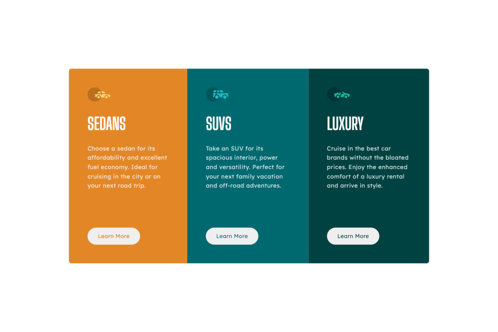

# Frontend Mentor: 3-column preview card component solution

This is a solution to the [3-column preview card component challenge on Frontend Mentor](https://www.frontendmentor.io/challenges/3column-preview-card-component-pH92eAR2-). Frontend Mentor challenges help you improve your coding skills by building realistic projects.

## Table of contents

-   [Overview](#overview)
    -   [The challenge](#the-challenge)
    -   [Screenshot](#screenshot)
    -   [Links](#links)
    -   [Built with](#built-with)
    -   [What I learned](#what-i-learned)
    -   [Continued development](#continued-development)
    -   [Useful resources](#useful-resources)
-   [Author](#author)

## Overview

### The challenge

Users should be able to:

-   View the optimal layout depending on their device's screen size
-   See hover states for interactive elements

### Screenshot

### Links

-   Solution URL: [Add solution URL here](https://your-solution-url.com)
-   Live Site URL: [Add live site URL here](https://your-live-site-url.com)

### Built with

-   Semantic HTML5 markup
-   CSS custom properties
-   Flexbox

### What I learned

I learned how to apply css flex-box to real css components. I refreshed my memory on basic css concepts like the box model. I also how to use variable units instead of static units to style things like padding, margin, and even font sizes.

Most importantly I learned the basics of how to use the BEM (Block, element, modifier) naming convention in CSS. It makes your CSS more modular and readable, and you know the exact purpose of each selector.

### Continued development

I want to continue using the BEM naming convention from now on, even in smaller projects because of how readable it makes your CSS.

### Useful resources

-   [Kevin Powell BEM Video](https://www.youtube.com/watch?v=SLjHSVwXYq4&pp=ygUHQ1NTIEJFTQ%3D%3D) - This was a great introduction to the basics of how the BEM naming convention works.
-   [Simple web dev article on BEM](https://simple-web.dev/bem-by-example) - This is also a great resource with more real world examples of how BEM is used.

## Author

-   Frontend Mentor - [@EtFX1](https://www.frontendmentor.io/profile/EtFX1)
-   Github - [@EtFX1](https://github.com/EtFX1)
